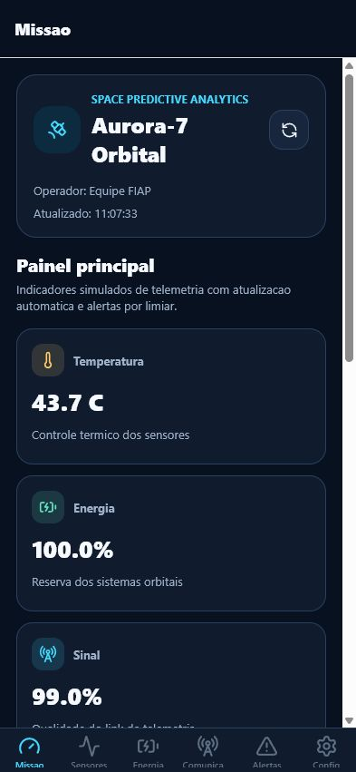
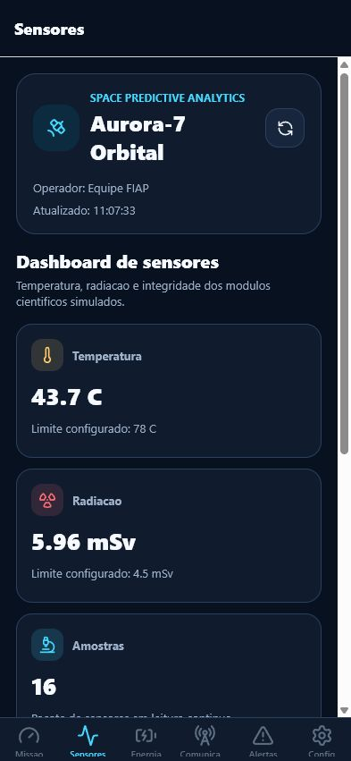
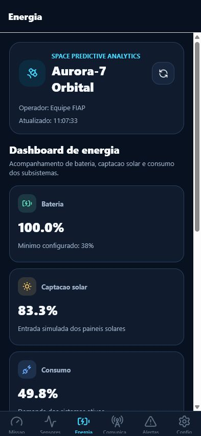
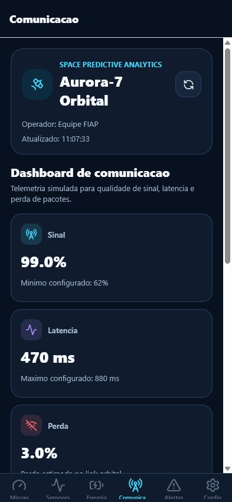
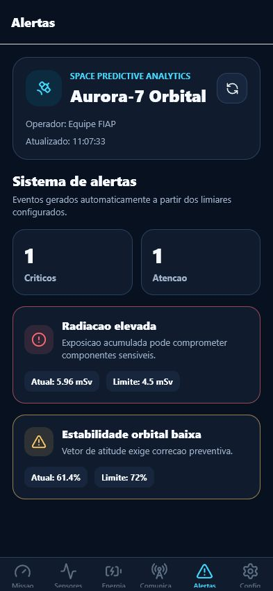
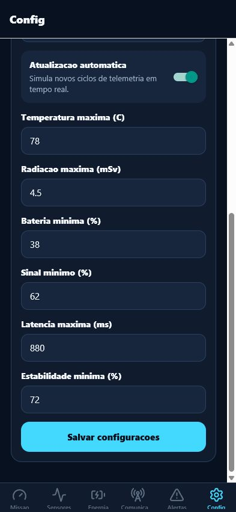

# Orbital Sentinel

### Global Solution 2026.1 - Cross-Platform Application Development | FIAP


## Descricao

Orbital Sentinel e um aplicativo mobile em React Native + Expo para monitoramento simulado de uma missao espacial. A solucao organiza dados de sensores, energia, comunicacao e estabilidade orbital em dashboards tematicos, gera alertas automaticos por limiares criticos e permite configurar parametros persistidos no dispositivo. O diferencial do app esta na leitura preditiva simples dos indicadores para apoiar decisoes em operacoes orbitais criticas.

## Equipe

| Nome | RM |
|------|----|
| Nome Completo | RM000000 |
| Nome Completo | RM000000 |
| Nome Completo | RM000000 |

## Repositorio

https://github.com/Brunoxfx/GS_-Cross-Platform

## Telas do Aplicativo

### Home - Dashboard Principal



Visao geral dos indicadores da missao: energia, temperatura, sinal, estabilidade orbital e alertas em destaque.

### Dashboard de Sensores



Graficos de barras com leituras simuladas de temperatura e radiacao ao longo dos ciclos recentes.

### Dashboard de Energia



Indicadores de bateria, captacao solar, consumo operacional e barras de status dos subsistemas.

### Dashboard de Comunicacao



Status do link de telemetria com qualidade do sinal, latencia e perda de pacotes.

### Alertas



Lista de alertas ativos gerados automaticamente conforme os limiares configurados.

### Configuracoes



Formulario para configurar nome da missao, operador, atualizacao automatica e limiares de alerta com validacao visual.

## Funcionalidades

- [x] Dashboard principal com indicadores em tempo real simulado
- [x] Minimo de 3 dashboards distintos: sensores, energia e comunicacao
- [x] Sistema de alertas automaticos baseado em limiares criticos
- [x] Persistencia de configuracoes e historico com AsyncStorage
- [x] Navegacao com Expo Router usando abas
- [x] Context API para estado global consumido em multiplas telas
- [x] Formulario de configuracao com validacao e feedback visual
- [x] Interface tematica espacial com componentes reutilizaveis
- [x] TypeScript em todo o projeto
- [ ] Integracao com API externa NASA ou ISS Tracking
- [ ] Video de demonstracao publicado

## Tecnologias

- React Native + Expo
- Expo Router
- TypeScript
- Context API
- AsyncStorage
- lucide-react-native
- react-native-svg

## Como Executar

### Pre-requisitos

- Node.js instalado
- Expo Go instalado no celular ou emulador Android/iOS configurado

### Instalacao

Clone o repositorio:

```bash
git clone https://github.com/Brunoxfx/GS_-Cross-Platform.git
```

Acesse a pasta:

```bash
cd GS_-Cross-Platform
```

Instale as dependencias:

```bash
npm install
```

Inicie o app:

```bash
npx expo start -c
```

Escaneie o QR Code com o Expo Go para rodar no dispositivo fisico.

## Video de Demonstracao

[Clique aqui para assistir a demonstracao](https://youtube.com/...)

## Arquivo de Entrega

```text
=== GLOBAL SOLUTION 2026.1 ===
Disciplina: Cross-Platform Application Development

Integrante 1: [Nome Completo] | RM: [XXXXXX]
Integrante 2: [Nome Completo] | RM: [XXXXXX]
Integrante 3: [Nome Completo] | RM: [XXXXXX]

GitHub: https://github.com/Brunoxfx/GS_-Cross-Platform
Video: https://...
```

## Licenca

Este projeto foi desenvolvido para fins academicos - FIAP 2026.
